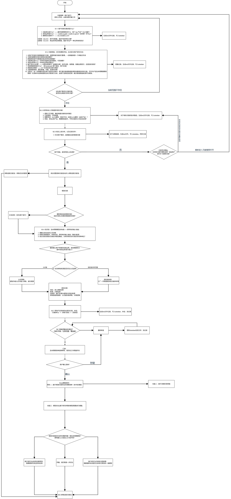
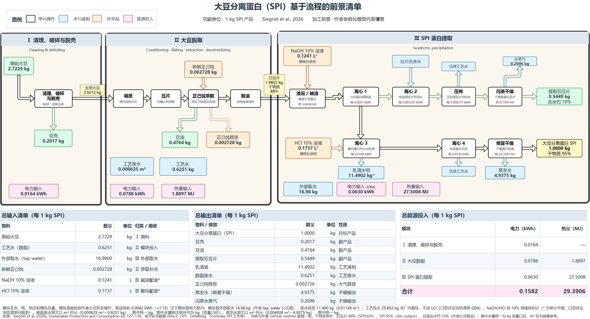
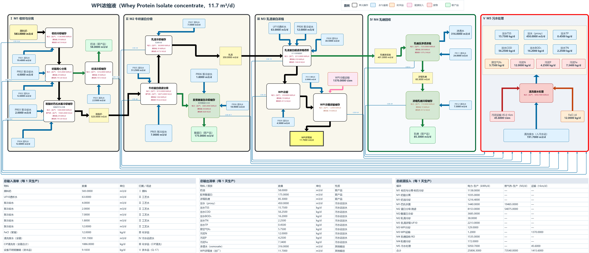

# lca-research-workflow

**[English](README.md) | 中文**

面向 LCA 研究者的集成式科研工作流 skill（文献 → 清单 → 模型 → 论文）。skill 主体目录为 `lci-process-flowchart-17/`。

## 这个项目解决什么问题

生命周期评价（LCA）科研的起点，往往是从几篇核心文献里把数据系统地"抠"出来：这篇文献的清单完不完整、功能单位能不能换算到我的课题、联产品是怎么处理的、哪些参数可以直接继承、哪些要重新找来源——这些判断零散、易错，而且一旦做错，后面的建模和论文全部返工。本 skill 把这段从文献到清单的关键路径工程化：**AI 负责逐篇审查、维度比对和初稿整理，人只在决策点把关**，每一步的取舍都登记在案、可追溯、可复跑。

工作流沿一条主线推进：从用户选定的文献出发，经审查打分选定框架文献 → 在框架文献的流程模型上界定边界、逐流提取数据 → 质量核查后冻结为结构化 Excel 清单 → 机器流水线把冻结清单编译、渲染成基于流程的生命周期清单图 → 作为后续 LCA 建模与论文写作的可信数据底座。总目标是**对产品构建生命周期模型，并在此基础上开展科研论文写作**。核心设计原则：候选与采用分离（文献原值与课题采用值分列，永不混写）、逐流溯源（每一行数据都能回答"出自哪篇文献哪张表"）、用户闸门确认（框架确认、冻结确认、建模接口判定三个决策点必须用户点头）、机器可复跑（整理与绘图有脚本和验证器，不靠一次性手工）、绘图必须过视觉验收。

**当前已实现**：F1 文献数据整理、F2 基于流程的清单图（均经两个真实论文案例端到端验收：大豆分离蛋白 SPI、乳清蛋白 WPI）。**路线图中**：F3 模型参数优化、F4 背景数据库接入（ecoinvent 等）、F5 LCIA 模型运算（Brightway 矩阵计算）、F6 GSA 不确定性分析、F7 科研绘图、F8 论文写作、F9 模型审查、F10 论文审稿——F3–F10 已登记定义于 `SKILL.md`，建成前任何功能不得越权执行（例如 F5 建成前全 skill 禁止计算 LCIA/LCC）。

## 总体架构

下图为科研全流程总架构（作者维护版；源文件 `assets/SKILL逻辑架构.drawio`，可用 draw.io 打开编辑；各功能内部执行细则见 `references/data-workflow.md` 与 `references/figure-workflow.md`）：



## 功能路由

详见 `SKILL.md` 的功能路由表。快速索引：

- **F1 文献数据整理**（已有，主入口）：回答三个问题——① 这些文献里有什么数据？② 哪些能用、哪些应该用？③ 据此怎么把课题模型建起来？交付冻结 Excel 清单；满足条件时附 Brightway2 建模接口说明（只做映射，不计算）。
- **F2 基于流程的清单图**（已有）：把冻结清单绘制为模块化流程图（三大模块横排：输入流框→单元操作→输出流框＋底部三张总表）。输入不限于本 skill 产出的清单，但必须达到同等数据质量门槛（来源可溯、候选与采用分离、经用户确认并冻结）。
- **F3 模型参数优化**（规划中）：在框架文献流程模型上，借鉴参数选取文献池优化参数。细则未建；范式三分类与分配/替代关注口径见 `references/data-workflow.md`，建模路线决策见 `SKILL.md` F3 条目。
- **F4–F10**（未建）：背景数据库接入（ecoinvent 等）、LCIA 模型运算（Brightway 矩阵计算）、GSA 不确定性分析、科研绘图、论文写作、模型审查、论文审稿。登记定义于 `SKILL.md`，建成前不得执行。

**不做的**（当前版本）：LCIA/LCC 核算（F5 建成前任何功能不得计算）、跨文献自动平均、一次性图片生成。

## 案例成果（功能二交付示例）

以下两图为本 skill 在两个真实论文课题上的端到端交付成果（基于流程的生命周期前景清单图；数据均来自公开文献，详见各案例目录 README）：

**大豆分离蛋白（SPI）**，框架文献 Siegrist et al. (2026)：



**乳清蛋白浓缩液（WPI）**，框架文献 Guyomarc'h et al. (2024)：



## 目录结构

```
lca-research-workflow/        # 仓库根目录即 skill 根目录
├── SKILL.md                  # 总纲＋路由表＋跨功能纪律＋各功能路由条目
├── assets/                   # 通用资产
│   ├── workbook-template.xlsx        # 数据功能工作簿模板（十二表）
│   ├── drawing-spec-template.json    # 绘图规格模板
│   ├── display-profile-default.json  # 显示档案
│   ├── SKILL逻辑架构.drawio/.png     # 科研全流程总架构图（作者维护版，README 内嵌预览）
│   └── *工作流*.drawio               # 数据/绘图功能流程图
├── scripts/                  # 机器流水线
│   ├── build_figure_spec.py          # 编译器 v2：冻结工作簿 → 完整规格
│   ├── render_figure.py              # 渲染器：规格 → .drawio（版式模板/自动排版两模式）
│   ├── extract_layout.py             # 从验收案例图提取版式模板（几何＋样式＋边走线）
│   ├── validate_workbook.py          # 工作簿校验 / 冻结
│   ├── validate_drawing_spec.py      # 规格校验
│   ├── validate_drawio_layout.py     # 成品图结构验证（--final 终验）
│   └── export_png.py                 # 视觉验收：draw.io 桌面版无头导出 PNG
├── references/               # 细则文档（数据工作流、Excel 模式、绘图细则、案例判决等 17 篇）
└── examples/
    ├── spi-siegrist2026/     # 端到端验收案例（数据、规格、黄金图、机器图、版式模板，均公开数据）
    └── wpi-guyomarch2024/    # 乳清案例金标准（冻结簿＋用户验收图；范式不同/边界裁剪判例）
```

## 快速开始

**绘图功能（SPI 案例复跑）**——在 skill 根目录：

```bash
python scripts/build_figure_spec.py examples/spi-siegrist2026/SPI_CLCA前景清单_v4.3_frozen.xlsx \
    --template assets/drawing-spec-template.json --profile assets/display-profile-default.json \
    --output spec.json
python scripts/render_figure.py spec.json \
    --style examples/spi-siegrist2026/figure-style-spi-siegrist2026.json \
    --layout examples/spi-siegrist2026/layout-spi-siegrist2026.json --output out.drawio
python scripts/validate_drawio_layout.py out.drawio --spec spec.json \
    --workbook examples/spi-siegrist2026/SPI_CLCA前景清单_v4.3_frozen.xlsx --final
python scripts/export_png.py out.drawio   # 视觉验收：必须亲自看图，必须 --scale 1
```

**数据功能**：从 `assets/workbook-template.xlsx` 建簿，按 `references/data-workflow.md` 步骤表逐关推进（S1 资料审查 → 框架确认（闸门 A）定框架 → S3 界定模型与逐流取数 → QC＋冻结确认（闸门 B）冻结 → 建模接口判定（闸门 C））；Excel 十二表结构与事实分工见 `references/excel-schema.md`。

**新案例绘图**：先用 `extract_layout.py` 从该课题的验收案例图提取版式模板（需一次性制作 `layout-*-map.json` 节点映射）；无模板时渲染器走固定户型自动排版。

## 验收纪律

结构验证 PASS ≠ 画对了。绘图交付前必须导出 PNG 目视比对（`scripts/export_png.py`，必须 `--scale 1`；scale 2 会触发 drawio 无头栅格化截断 bug，自动探测 draw.io 桌面版，可用 `DRAWIO_EXE` 指定）。历史教训：边拐点在案例图中是容器相对坐标，提取时必须只取 `<Array as="points">` 真拐点并换算绝对坐标，否则成品图会拉出跨图斜线——这类错误结构校验发现不了。

## 参考与致谢

- 案例数据：Siegrist et al. (2026), *Sustainable Production and Consumption*（论文公开附件与作者 GitHub 数据）。
- 绘图规范参考：draw.io 官方 [`jgraph/drawio-mcp`](https://github.com/jgraph/drawio-mcp) 维护的 XML 生成规范（`xml-reference.md`）；视觉验收依赖 [draw.io 桌面版](https://github.com/jgraph/drawio-desktop)无头导出。

## 版本

- **v17**（当前）：总纲 hub 化改造——SKILL.md 改为「功能路由表＋跨功能不可变纪律＋功能路由条目」三层结构；功能从 2 个扩编为 11 个（新增 F3–F10 登记：模型参数优化、背景数据库接入、LCIA 模型运算、GSA 不确定性分析、科研绘图、论文写作、模型审查、论文审稿）；边界缩小显式询问、能源完整性主动核查等原仅见于 SKILL.md 的条文下沉至 `data-workflow.md`；删除直通模式（用户裁定：不存在该情形，出现即报错核对）；乳清案例更正为范式不同判例（文 ALCA→课 CLCA：放弃分配因子，走边际供应商＋副产品替代，簿内登记 Q-19）；机器流水线操作细节（命令、scale 1 教训、拐点教训）下沉至 `figure-workflow.md`。F1、F2 执行能力不变。
- **v15**：绘图功能全机器流水线（编译器 v2＋渲染器＋版式模板）；新增视觉验收环节；SPI 案例回归测试通过（41/41 版式几何、27 边零差异、能源表 15 格一致）。
- 历史版本按 skill 多副本纪律在本地归档，不在本仓库内。

## 作者与联系

**yu**，浙江农林大学（Zhejiang A&F University）。

本仓库为 skill 的稳定公开版；**最新开发版欢迎联系获取**。联系方式：邮件 yxy927s2@gmail.com，或在本仓库提交 [Issue](../../issues)。

## 许可证

- **代码**（`scripts/` 等）：[MIT License](LICENSE)
- **文档**（README、`references/`、`SKILL.md`、流程图）：[CC BY-SA 4.0](https://creativecommons.org/licenses/by-sa/4.0/deed.zh-hans)
- **案例数据**（`examples/` 中的冻结工作簿）：整理自下列公开文献与公开附件，使用请以原出版物的条款为准——Siegrist et al. (2026), *Sustainable Production and Consumption*；Guyomarc'h et al. (2024)（乳清蛋白案例，详见各案例目录 README）。
